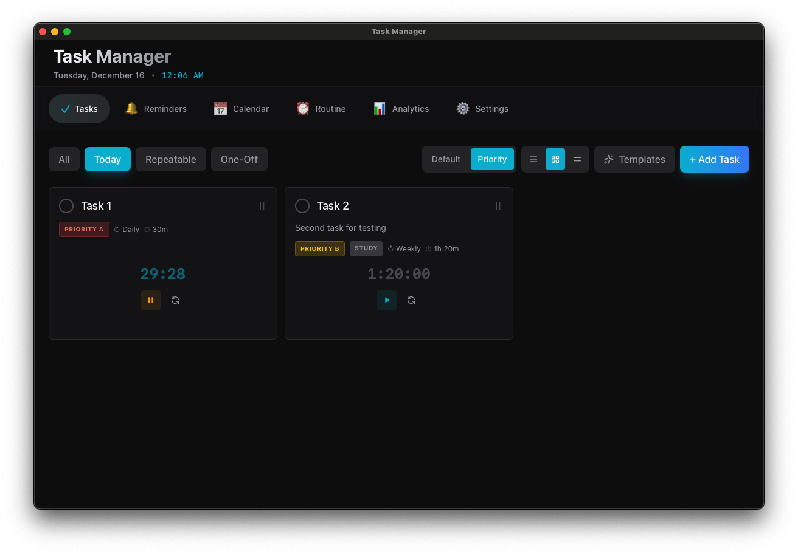
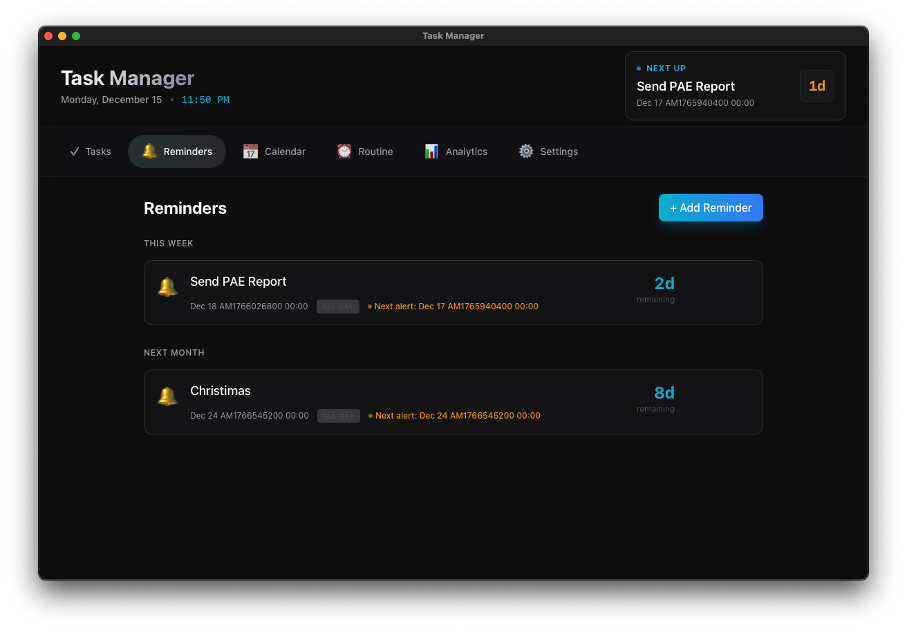
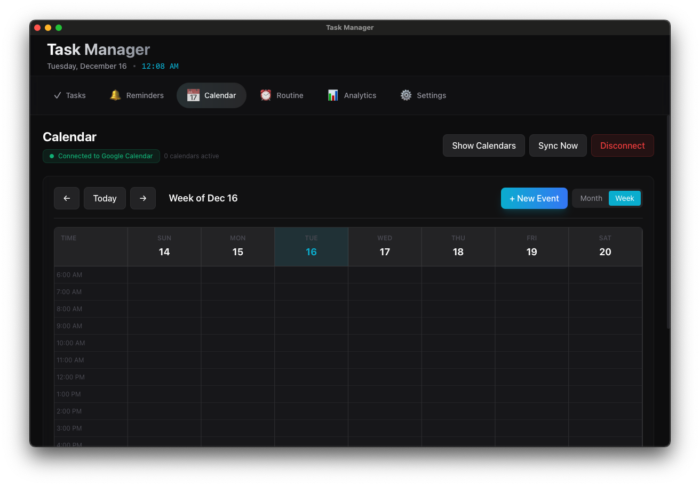
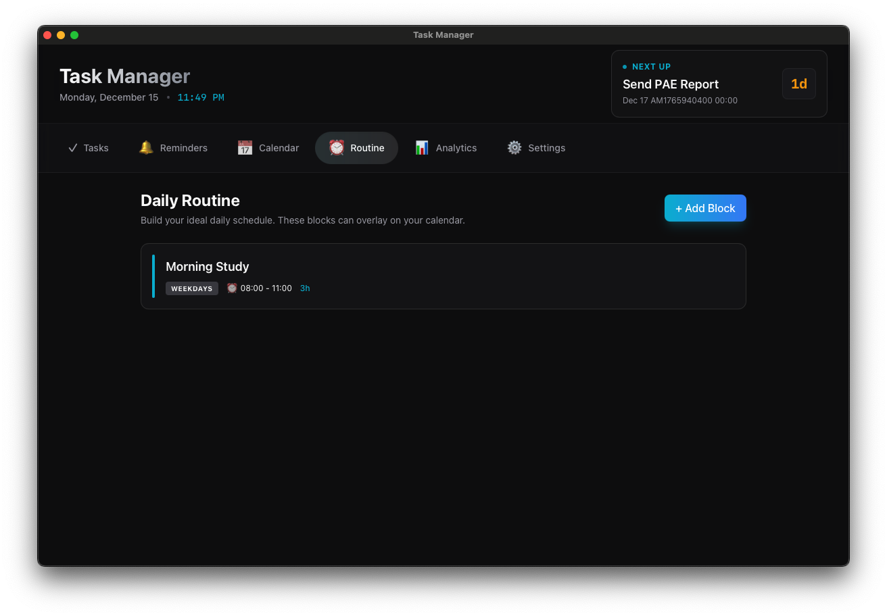
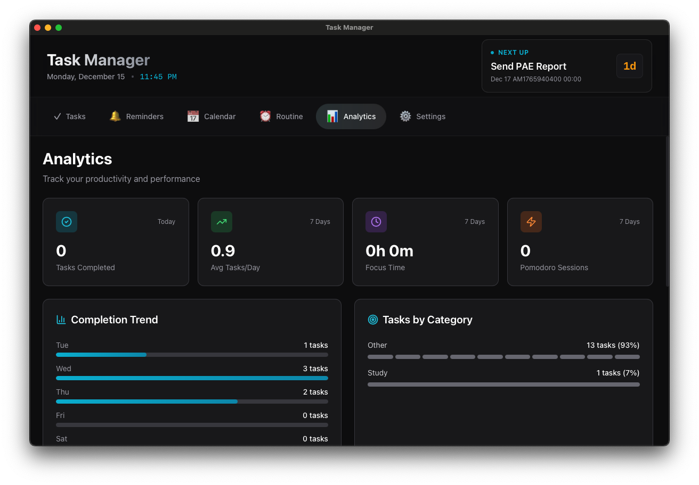
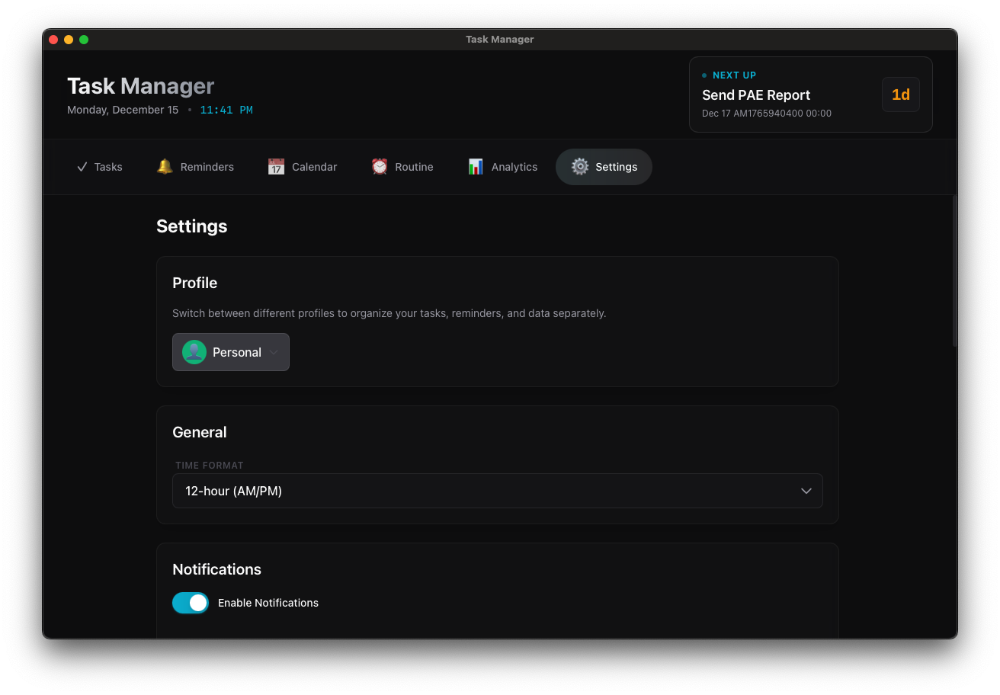

# Task Manager 📋

> A cross-platform productivity app built with Tauri v2, React, and TypeScript

<div align="center">

[](https://tauri.app/)
[](https://reactjs.org/)
[](https://www.typescriptlang.org/)
[](LICENSE)

[Features](#features) •
[Demo](#demo) •
[Installation](#installation) •
[Documentation](#documentation) •
[Development](#development)

</div>

---

## ✨ Features

- **📝 Smart Task Management** - Create repeatable tasks with timers and automatic completion tracking
- **⏰ Advanced Reminders** - Set multiple notification offsets for events and birthdays
- **📅 Calendar Integration** - Google Calendar sync support (OAuth setup required)
- **🔄 Daily Routine Builder** - Design and visualize your ideal daily schedule
- **🎨 Modern Dark UI** - Sleek, accessible interface with Tailwind CSS
- **🔔 Desktop Notifications** - Native OS notifications that actually work
- **📊 Analytics Dashboard** - Track your productivity patterns and task completion
- **💾 Local-First Storage** - All data stored securely on your device
- **🚀 Auto-launch** - Start with your system (optional)
- **🌐 System Tray** - Minimize to tray, stays out of your way

## 🎯 Demo

### Live Demo
👉 **[View Live Demo on GitHub Pages](https://your-username.github.io/task-manager/)**

> **Note**: The web demo showcases the UI/UX but lacks some desktop features like native notifications and system tray integration. Download the desktop app for the full experience.

### Screenshots

<details>
<summary><b>📝 Tasks Management</b></summary>


*Organize tasks with categories, timers, and repeat schedules*

</details>

<details>
<summary><b>⏰ Reminders & Events</b></summary>


*Never miss important dates with smart notification offsets*

</details>

<details>
<summary><b>📅 Calendar Integration</b></summary>


*Sync with Google Calendar and view all your events*

</details>

<details>
<summary><b>🔄 Daily Routine</b></summary>


*Plan your perfect day with visual time blocks*

</details>

<details>
<summary><b>📊 Analytics Dashboard</b></summary>


*Track productivity trends and completion rates*

</details>

<details>
<summary><b>⚙️ Settings & Preferences</b></summary>


*Customize notifications, themes, and data management*

</details>

## 🚀 Quick Start

### Prerequisites

- **Node.js** 18+ ([Download](https://nodejs.org/))
- **Rust** (latest stable) - Install via [rustup](https://rustup.rs/)
- **System dependencies** - See [Installation Guide](docs/INSTALLATION.md)

### Install & Run

```bash
# Clone the repository
git clone https://github.com/your-username/task-manager.git
cd task-manager/task-manager

# Install dependencies
npm install

# Run in development mode
npm run tauri dev
```

### Build Desktop App

```bash
# Build for your platform
npm run tauri build

# Or use Make (from repo root)
make release
```

Installers will be in `task-manager/src-tauri/target/release/bundle/`:
- 🍎 macOS: `.dmg` and `.app`
- 🪟 Windows: `.msi` and `.exe`
- 🐧 Linux: `.deb` and `.AppImage`

### Deploy to GitHub Pages

```bash
# Build static website (from task-manager directory)
npm run build:pages

# Or use Make (from repo root)
make build-pages
```

Then push to GitHub and enable Pages in Settings → Pages → Deploy from `/docs` folder.

## 📚 Documentation

Comprehensive guides for getting started and contributing:

- **[📥 Installation Guide](docs/INSTALLATION.md)** - Detailed setup instructions for all platforms
- **[📖 User Guide](docs/USER_GUIDE.md)** - Complete feature walkthrough and tips
- **[🛠️ Development Guide](docs/DEVELOPMENT.md)** - Architecture, contributing, and extending
- **[📘 API Documentation](docs/API.md)** - Service APIs and data models

## 🛠️ Development

### Project Structure

```
task-manager/
├── task-manager/              # Main application folder
│   ├── src/                   # React frontend
│   │   ├── components/        # Reusable UI components
│   │   ├── features/          # Feature modules (tasks, calendar, etc.)
│   │   ├── services/          # Business logic & APIs
│   │   ├── store/             # Zustand state management
│   │   └── types/             # TypeScript definitions
│   ├── src-tauri/             # Rust backend
│   │   ├── src/               # Tauri app logic
│   │   └── Cargo.toml         # Rust dependencies
│   └── package.json
├── docs/                      # Documentation & GitHub Pages
│   ├── images/                # Screenshots
│   ├── *.md                   # Documentation files
│   └── index.html             # Static site (generated)
├── Makefile                   # Build automation
└── README.md                  # This file
```

### Tech Stack

| Layer | Technology |
|-------|-----------|
| **Desktop Runtime** | Tauri v2.0 |
| **Frontend** | React 18 + TypeScript 5 |
| **Styling** | Tailwind CSS |
| **State Management** | Zustand |
| **Build Tool** | Vite |
| **Backend** | Rust |
| **Date/Time** | date-fns |
| **Icons** | Lucide React |

### Available Commands

```bash
# Development
npm run dev              # Start Vite dev server
npm run tauri dev        # Run desktop app with hot reload

# Building
npm run build            # Build frontend
npm run build:pages      # Build for GitHub Pages
npm run tauri build      # Build desktop app

# From repo root (using Make)
make dev                 # Start development server
make build               # Build frontend
make build-pages         # Build for GitHub Pages
make release             # Build desktop app
make clean               # Clean build artifacts
```

## 🤝 Contributing

Contributions are welcome! Please see our [Development Guide](docs/DEVELOPMENT.md) for details on:

- Setting up your development environment
- Code style and conventions
- Submitting pull requests
- Adding new features

## 📝 License

This project is licensed under the MIT License - see the [LICENSE](LICENSE) file for details.

## 🙏 Acknowledgments

- Built with [Tauri](https://tauri.app/) - Amazing Rust-powered desktop framework
- UI components inspired by modern design systems
- Icons by [Lucide](https://lucide.dev/)

## 💬 Support

- **Documentation**: Check the [docs](docs/) folder
- **Issues**: [GitHub Issues](https://github.com/your-username/task-manager/issues)
- **Discussions**: [GitHub Discussions](https://github.com/your-username/task-manager/discussions)

---

<div align="center">

**Built using Tauri, React, and TypeScript**

[⬆ Back to Top](#task-manager-)

</div>
